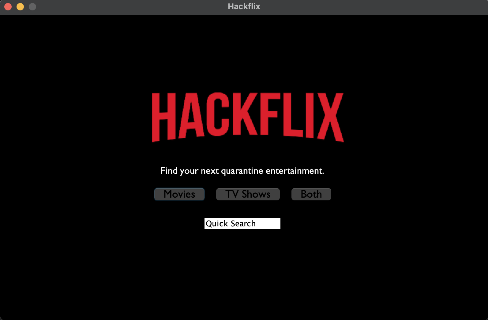
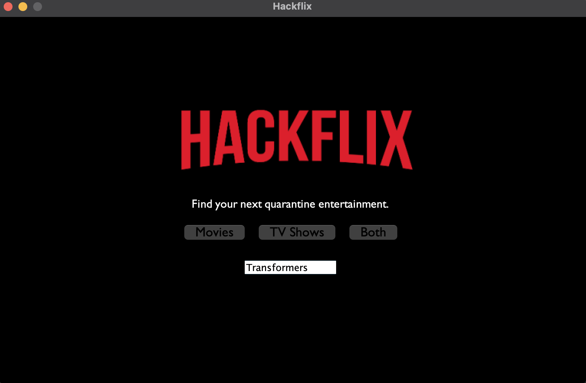
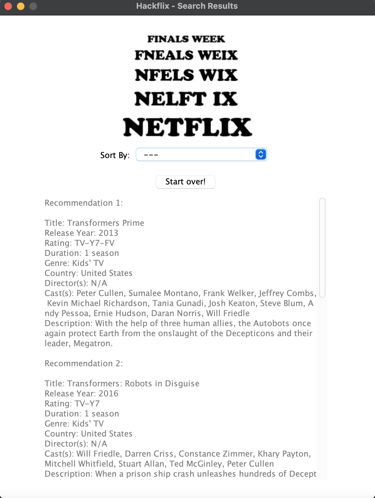
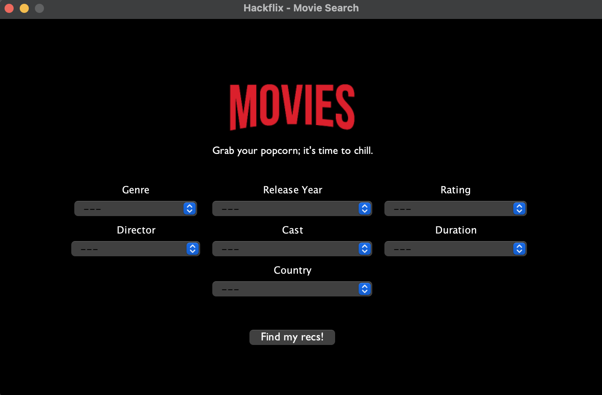
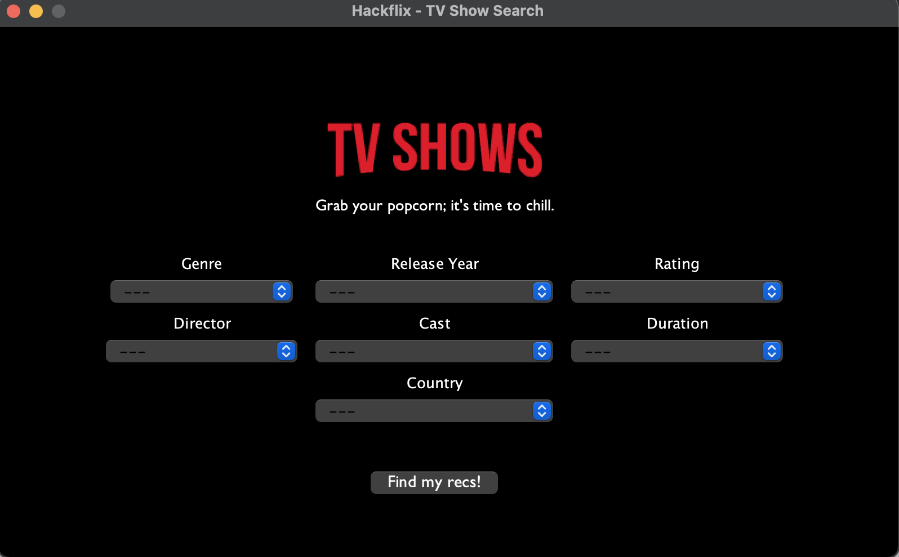
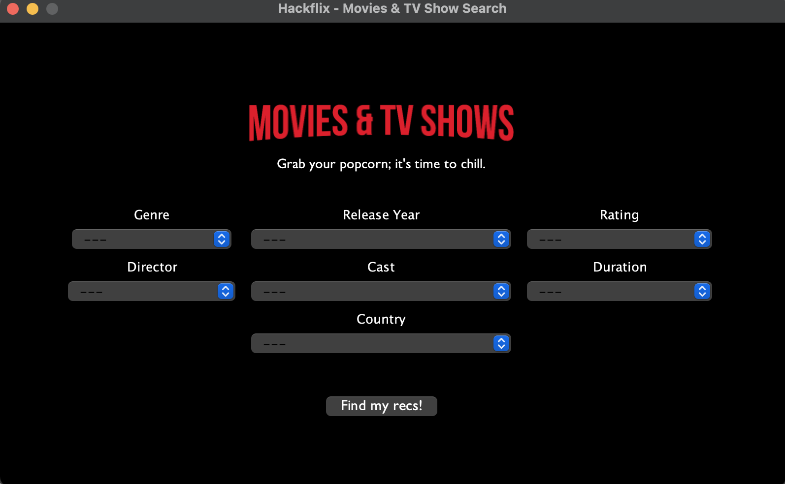
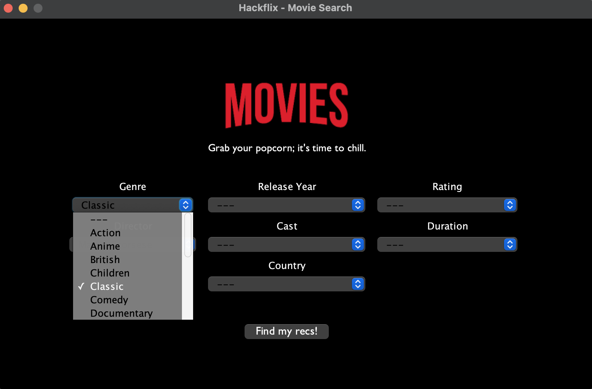
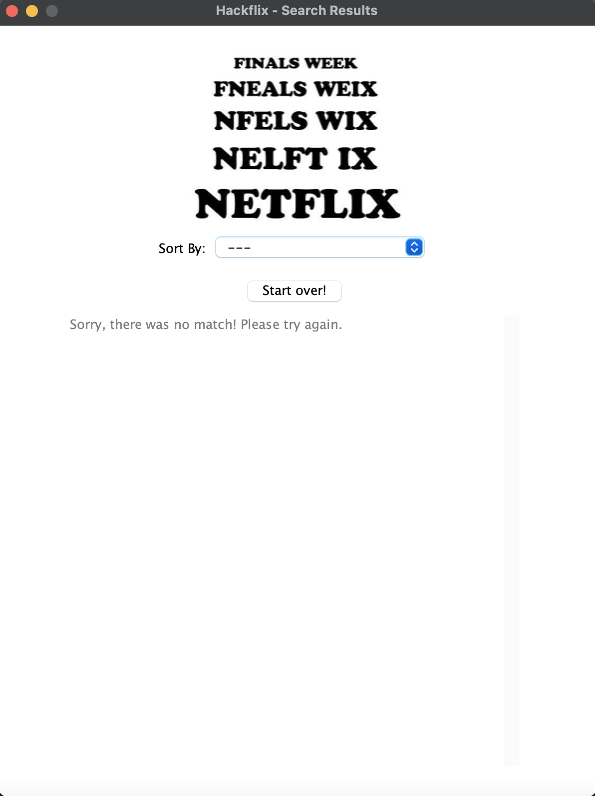

# Hackflix 🎬

## Overview

### Project Summary

Hackflix is an app that helps you decide what to watch on Netflix. You provide Hackflix with your preferences and it filters the 6000+ unique movies and TV shows to match those preferences as best as possible. Kiss Netflix-related-decision-paralysis goodbye, because Hackflix is here to cut down the insurmountable amount of content Netflix has to offer into a manageable selection based on what you actually want to watch.

#### :computer: Devpost project page
https://devpost.com/software/hackflix

#### :octocat: GitHub repository 
https://github.com/tgeorge1001/Eri-James-George.git

### Authors

* **Eri Arai** - eriarai – eriarai@seas.upenn.edu – [GitHub](https://github.com/eri-arai)
* **Thumpasery Joseph George** - tjgeorge – tjgeorge@seas.upenn.edu – [GitHub](https://github.com/tgeorge1001)
* **James Grimes** - jdgrimes – jdgrimes@seas.upenn.edu – [GitHub](https://github.com/phewf)

## Usage

### Prerequisites

The primary prerequisite is the [Eclipse IDE for Java Developers](https://www.eclipse.org/downloads/packages/release/2020-12/r/eclipse-ide-java-developers). Install it by downloading the file for your particular operating system. Launch the downloaded file, and follow the prompts.

Once Eclipse is installed, you must also install [WindowBuilder Pro](https://www.eclipse.org/windowbuilder/download.php). Dragging the install image from the website to your open Eclipse window should trigger the installation. Follow the proceeding prompts to install.

Lastly you must install [Univocity](https://www.univocity.com/pages/univocity_parsers_download). Download the most recent release zip file, and unzip it. Take note of its location on your computer's file path.

### Installation

1. Clone our repository locally and open it in Eclipse, with WindowsBuilder Pro installed.
2. Right click the cloned project in Eclipse's package explorer.
3. Navigate to Build Path, and click on Add External Archives. (This should cause a window to appear where you can navigate your file system.)
4. In this window navigate to the location where you unzipped univocity, and find the .jar file that has a name that begins with "univocity_parsers", select it, and click on the "Open" button.

## Key Functionality
To launch the Hackflix app, run the Main.java file from Eclipse to open the main Hackflix application page.

There are two primary features to this application: (1) quick keyword search and (2) advanced search.

### 1.	Quick Search
The quick search function can be used if the user knows what movie or TV show they are looking for. For example, maybe the user wants to see if any of the *Transformer* series are on Netflix. To conduct a quick search, the user can simply type in the full name or a keyword from the movie or TV show they are looking for and hit Enter.

The search results page will be automatically launched with the results in a scrollable text panel. If there is more than one result, the results listed in random order. The user can change the order in which their recommendations are displayed by selecting from the drop-down menu to sort the results alphabetically (ascending or descending) or by release year (ascending or descending). There is a maximum of 25 results displayed so the user will have a sizeable, but not-too-overwhelming selection of shows to browse through.

### 2.	Advanced Search
The advanced search function can be used to browse and find Netflix movies and/or TV shows based on the preferences they select. To get started, the user can press one of the three buttons on the main screen depending on which type of show they would like to find: "Movies", "TV Shows", or "Both" (Movies & TV shows).

If the user selects "Movies", then the application will switch to a query-building window to search for all Movies available on Netflix.

Likewise, if the user selects "TV Shows", then the application will switch to a query-building window to search for all TV shows available on Netflix.

Finally, if the user selects "Both", then the application will switch to a query-building window to search for both Movies and TV shows available on Netflix.

To make the search comprehensive, we included seven different parameters to facilitate finding the perfect recommendation. This functionality allows the user to make one selection for each search parameter. The user can also leave any or all of the parameters blank. Below is a brief description of each search parameter:

* <strong>Genre</strong> – We provided 18 total genres to select from. These include the following: Action, Anime, British, Children, Classic, Comedy, Documentary, Drama, Horror, Indie, International, Musical, Reality, Romance, Sci-Fi & Fantasy, Spanish-Language, Sports, Thriller.   
* <strong>Release Year</strong> – We provided seven film release year options to select from. The release years were grouped by decade: pre-1960s, 1970s, 1980s, 1990s, 2000s, 2010s, 2020.  
*	<strong>Rating</strong> – We provided six different motion picture ratings that provide the film's suitability for certain audiences based on its content: G/TV-G or lower, PG/TV-PG, PG-13/TV-14, R/TV-MA, NC-17, NR (Not Rated)   
*	<strong>Director</strong> – We provided a sorted list of popular film directors, including: Alfred Hitchcock, Christopher Nolan, M. Night Shyamalan, Martin Scorsese, Peter Jackson, Quentin Tarantino, Stanley Kubrick, Steven Spielberg, Taika Waititi, Tim Burton  
*	<strong>Cast</strong> – We provided a sorted list of popular starring actors and actresses. These include the following stars: Angelina Jolie, Anne Hathaway, Ben Affleck, Brad Pitt, Charlize Theron, Christian Bale, Clint Eastwood, Dwayne Johnson, George Clooney, Jackie Chan, Jennifer Aniston, Jennifer Lawrence, Johnny Depp, Julia Roberts, Leonardo DiCaprio, Matt Damon, Meryl Streep, Morgan Freeman, Natalie Portman, Nicole Kidman, Robert De Niro, Ryan Gosling, Scarlett Johansson, Tom Cruise  
*	<strong>Duration</strong> – We provided four different film durations for the user to choose from. These include the following:  
    * 1 Season – TV-only  
    *	Short Film – less than 40 min   
    *	Featurette – between 40 min and 75 min  
    *	Feature Film – 75 min or longer  
*	<strong>Country</strong> – This is the country in which the movie or TV show was produced. There are 64 production countries in the selection list, which are ordered in ascending alphabetical order.  

Once a user has selected all of their desired criteria, the advanced search is executed by clicking the "Find my recs!" button on the bottom. Similar to the quick search, a new window will be automatically launched with the results in a scrollable text panel. Additionally, the user can change the order in which results are displayed by selecting from the drop-down menu to display results alphabetically (ascending or descending) or by release year (ascending or descending) and there is a maximum of 25 results displayed. 

If there is no match, a message will appear encouraging the user to try again.

Finally, if the user is not satisfied with their list of recommendations or could not find any matches from their selected criterion, they can press the "Start over!" button under the "Sort by:" selection bar on the search results page to return back to the main menu.

## Additional Information

### Tools used

* [Univocity](https://www.univocity.com/pages/about_univocity) - Data manipulation used for CSV parsing.
* [WindowBuilder Pro](https://www.eclipse.org/windowbuilder/) - Used for building the GUI.
* [Kaggle's Netflix Movies and TV Shows Data Set](https://www.kaggle.com/shivamb/netflix-shows) - Underlying Netflix data that we use to filter and be filtered.

### Acknowledgments

* Inspired by Eri Arai's Fall 2019 CIT 591 final project: Virtual Sommelier Application 🍷.

### License

>This package is licensed under the [MIT License](https://github.com/tgeorge1001/Eri-James-George/blob/master/LICENSE.txt).
